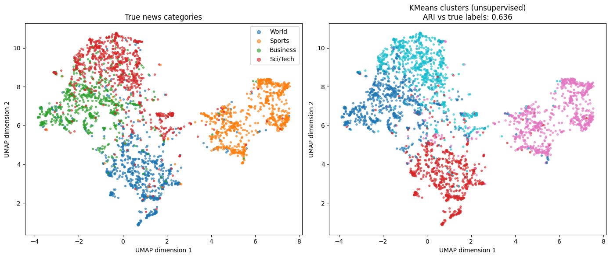

# Semantic News Search

[](https://github.com/YOUR_GITHUB_USERNAME/semantic-news-search/actions/workflows/ci.yml)
[](https://colab.research.google.com/github/YOUR_GITHUB_USERNAME/semantic-news-search/blob/main/notebooks/semantic_news_search.ipynb)


Two questions, one set of sentence embeddings:

1. **Can a pretrained embedding model recover the structure of news text without ever seeing the category labels?**
2. **Can the same embeddings power a search engine that matches on meaning instead of keywords?**

The project embeds a 3,000-article sample of [AG News](https://huggingface.co/datasets/fancyzhx/ag_news) with `all-MiniLM-L6-v2`, clusters it with KMeans, visualizes it with UMAP, and serves natural-language queries with cosine-similarity retrieval.

## Results



**Clustering.** KMeans (k=4) on the full 384-dimensional embeddings, with no access to labels, reaches an **Adjusted Rand Index of 0.636** against the true AG News categories (0 = chance, 1 = perfect). Sports is a clean island and World separates well. Business and Sci/Tech overlap heavily, which is where most of the disagreement lives. That is partly real ambiguity (tech-company earnings are both) and partly label noise in the dataset.

**Search.** Queries are matched on meaning rather than exact keywords, so the wording of a query doesn't have to line up with the article:

| Query | Top result | Cosine |
|---|---|---|
| a company's stock price falling after a bad earnings report | "Stocks Slip on GM Earnings, Higher Oil…" | 0.587 |
| an athlete winning a gold medal | "Guerrouj Captures Gold in the 5,000…" | 0.534 |
| tensions between two countries over a border dispute | "Brussels likely to put deficit disputes on ice…" | 0.402 |
| a new breakthrough in artificial intelligence | "IBM aims for top 10 with new Spanish supercomputer" | 0.318 |

The last two rows are the interesting ones. The border-dispute query returns loosely related political-tension stories rather than an exact match, and the AI query is weak (top score ~0.3) because AG News dates from 2004 and has almost no modern AI coverage. Retrieval can only surface what is in the corpus, and a low top score is the signal that nothing relevant matched.

> These numbers come from the recorded run in [`notebooks/semantic_news_search.ipynb`](notebooks/semantic_news_search.ipynb) (seed 42, 3,000 samples, no text cleaning). Expect small differences across UMAP / scikit-learn / sentence-transformers versions.

## How it works

1. **Data:** shuffle AG News with a fixed seed and take 3,000 training articles (about balanced across the four classes).
2. **Embeddings:** encode each article with `all-MiniLM-L6-v2` into a 384-d vector.
3. **Clustering:** KMeans on the full-dimensional embeddings. UMAP to 2D is used **for plotting only**, since clustering in the projection would discard information.
4. **Evaluation:** Adjusted Rand Index between clusters and true labels, which is invariant to how clusters are numbered.
5. **Search:** embed the query with the same model and rank documents by cosine similarity (exact, brute force).

## Quick start

**In the browser:** click the Colab badge above. The first cell installs everything.

**Locally:**

```bash
git clone https://github.com/YOUR_GITHUB_USERNAME/semantic-news-search.git
cd semantic-news-search
python -m venv .venv && source .venv/bin/activate
pip install -e ".[ml]"          # or: pip install -r requirements.txt
```

Reproduce the clustering experiment (saves a figure and `metrics.json` to `outputs/`):

```bash
python scripts/run_pipeline.py
```

Search from the command line (embeddings are cached in `data/cache/` after the first run):

```bash
python scripts/search.py "an athlete winning a gold medal"
python scripts/search.py            # interactive mode
```

Or use it as a library:

```python
from newssearch import SemanticSearchIndex
from newssearch.data import load_ag_news
from newssearch.embeddings import embed_texts, load_model

df = load_ag_news(n_samples=3000, clean=True)   # clean=True strips HTML artifacts
model = load_model()
embeddings = embed_texts(df["text"].tolist(), model)

index = SemanticSearchIndex(df["text"], embeddings, model, categories=df["label_name"])
for r in index.search("central bank raises interest rates", top_k=3):
    print(f"[{r.score:.3f}] ({r.category}) {r.text}")
```

## Project structure

```
semantic-news-search/
├── notebooks/semantic_news_search.ipynb   # annotated walkthrough with recorded outputs
├── src/newssearch/
│   ├── config.py        # seeds, model name, label map
│   ├── data.py          # AG News loading + text cleaning
│   ├── embeddings.py    # model loading, encoding, on-disk cache
│   ├── clustering.py    # KMeans + ARI / NMI evaluation
│   ├── search.py        # SemanticSearchIndex (cosine-similarity retrieval)
│   └── viz.py           # UMAP projection and the comparison plot
├── scripts/
│   ├── run_pipeline.py  # end-to-end clustering experiment
│   └── search.py        # search CLI
├── tests/               # pytest suite (no network or model download needed)
├── images/cluster_comparison.png
└── .github/workflows/ci.yml
```

## Testing

```bash
pip install -e ".[dev]"
pytest
```

The tests use a tiny deterministic stub encoder in place of the real model, so they run in seconds without downloading weights, and CI installs only the light dependencies. They cover ranking order, `top_k` handling, input validation, cluster recovery on synthetic data, metric invariance to cluster numbering, the embedding cache, and text cleaning.

## Limitations

- **Noisy labels.** AG News categories are imperfect (for example, a GM earnings story is labeled "World"), so ARI understates how coherent the clusters are.
- **Old, narrow corpus.** The data is from 2004 and only 3,000 articles are indexed, so many queries have no good match. Nothing in the search enforces a minimum score.
- **Exact search only.** Brute-force cosine similarity is fine at this size. For millions of documents, use an approximate index such as FAISS or hnswlib.
- **One small English model.** `all-MiniLM-L6-v2` is fast but not state of the art, and no other models are compared here.

## Ideas for extending it

- Compare embedding models (for example `bge-small`, `e5-small`) on ARI and retrieval quality.
- Quantify retrieval with precision@k, treating same-category results as weak relevance.
- Label each cluster automatically with its top TF-IDF terms.
- Add a Streamlit or Gradio search demo.

## License

MIT. See [LICENSE](LICENSE).
